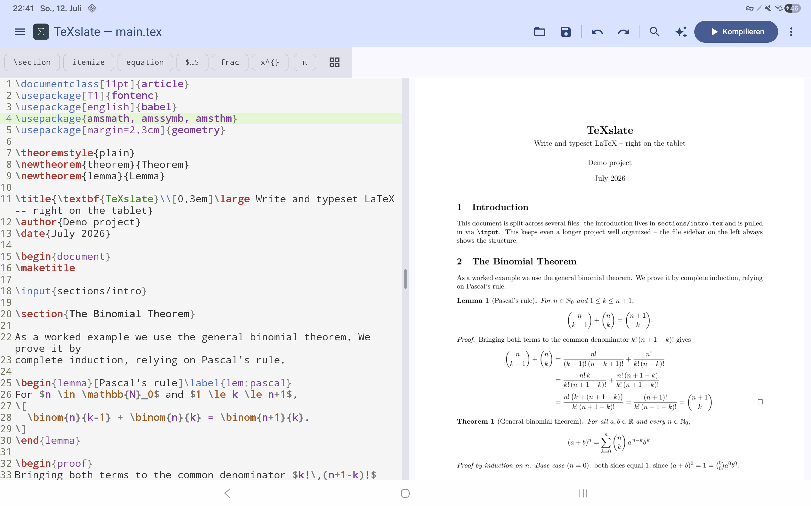
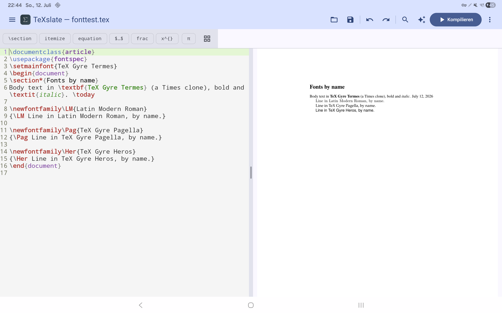
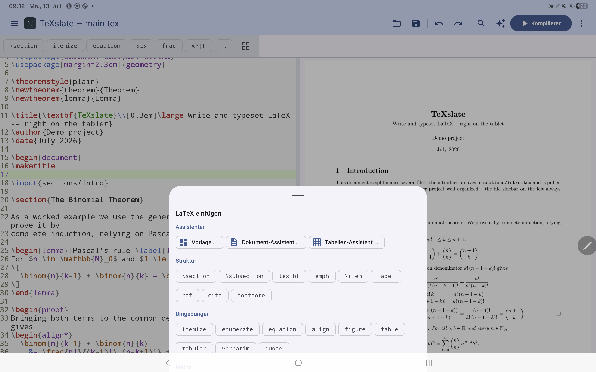
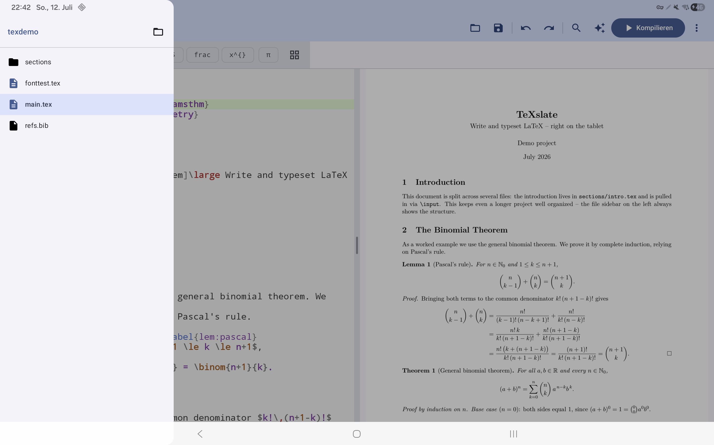
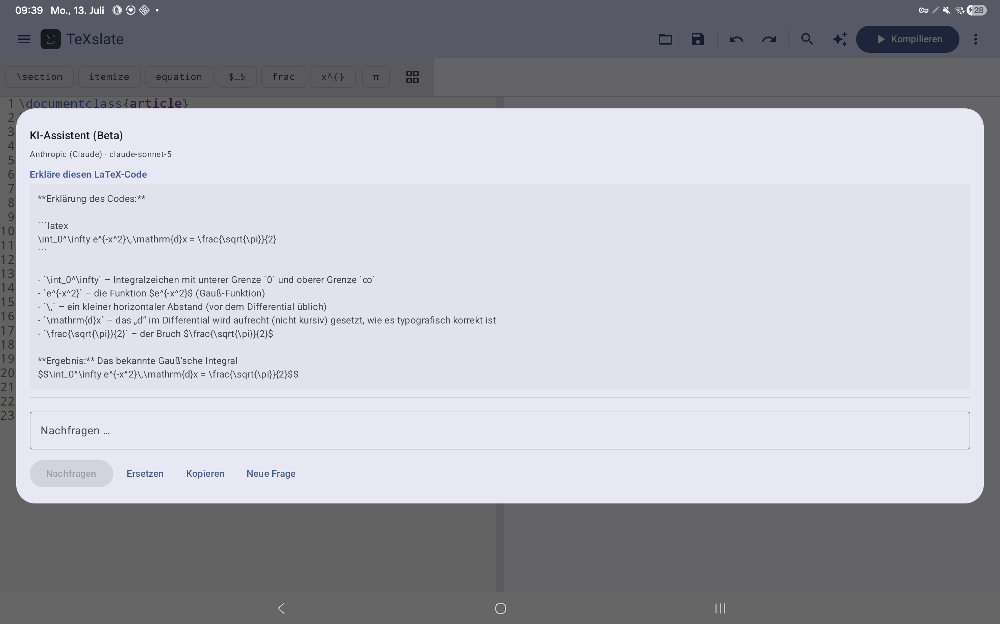

<p align="center">
  
</p>

<p align="center"><strong>Nativer LaTeX/XeTeX-Editor für Android — Tablet-first.</strong></p>

<p align="center">🇬🇧 <a href="./README.md">English</a> · 🇩🇪 <strong>Deutsch</strong></p>

Schreibe LaTeX direkt auf dem Tablet und sieh das PDF live daneben entstehen —
ohne Terminal, ohne Cloud, ohne Begleit-PC. TeXslate vereint Editor, einen
**Compiler auf dem Gerät** und eine PDF-Vorschau in einer nativen Android-
Oberfläche, mit eingedeutschten Fehlermeldungen und einem **optionalen**
KI-Assistenten (eigener API-Schlüssel, standardmäßig aus).

Die App gibt es auf **Englisch (Standard) und Deutsch**; sie folgt automatisch
deiner Gerätesprache.



_Split-View auf dem Tablet: links der LaTeX-Editor, rechts das live gerenderte PDF — ein echtes Mehrdatei-Projekt (`\input`), das den allgemeinen binomischen Lehrsatz per Induktion beweist, lokal über Tectonic kompiliert._



_Schriften über den Namen: `\setmainfont{TeX Gyre Termes}` & Co. funktionieren einfach — gebündelte Latin Modern & TeX Gyre plus deine Android-Systemschriften, alle über den Namen auflösbar._



_Touch-Palette: gängige Bausteine mit einem Tipp einfügen (Umgebungen, Mathe-Symbole, Struktur) — der Cursor landet automatisch an der richtigen Stelle._



_Mehrdatei-Projekte: der Projektordner als Sidebar (Dateibaum), Dateiwechsel per Tipp — `\input` aus Unterordnern und `.bib` inklusive._



_Optionaler KI-Assistent (BYOK): markiere ein Stück LaTeX, das du nicht verstehst, und lass es dir Zeile für Zeile erklären (hier das Gauß-Integral). Er erklärt Quellcode — er ist kein allgemeiner Chatbot. Nichts wird gesendet, bevor du es im Vorschau-Dialog bestätigst._

## Funktionen

- **Editor** mit LaTeX-Syntax-Hervorhebung (TextMate-Grammatik) und einer Touch-
  Palette für gängige Bausteine, Umgebungen und Mathe-Symbole; der Cursor landet
  automatisch an der richtigen Stelle.
- **Compiler auf dem Gerät** (Tectonic/XeTeX) — kein Terminal, keine Cloud.
  Optionales **Auto-Compile** beim Tippen.
- **PDF-Vorschau** daneben (Tablet-Split-View mit verschiebbarem Trenner) oder als
  Tab auf schmalen Displays.
- **Schriften über den Namen**: `\setmainfont{…}` funktioniert offline — ein
  kuratierter Satz (Latin Modern Roman, TeX Gyre Termes/Pagella/Heros) ist
  gebündelt und über den Namen auflösbar, ebenso deine Android-Systemschriften und
  jede `.otf`/`.ttf`, die du in den Schriften-Ordner der App legst.
- **Eingedeutschte Fehler**: die häufigsten TeX-Meldungen werden als kurze,
  verständliche Sätze in der UI-Sprache umformuliert; ein Tipp springt zur
  Fehlerzeile.
- **Mehrdatei-Projekte**: Projektordner-Sidebar (Dateibaum), Dateiwechsel per Tipp,
  `\input`/`\include` und Bibliografie (`bibtex`, sowie `biblatex` mit
  `backend=bibtex`).
- **Editor-Komfort**: Suchen & Ersetzen (inkl. Regex), Gehe zu Zeile,
  **Dokument-Gliederung** (zu Abschnitten springen wie in Kile), Kommentar ein/aus
  für eine Zeile oder Auswahl, ein greifbarer Scroll-Griff.
- **Assistenten & Vorlagen**: Dokument- und Tabellen-Assistent, kuratierte Vorlagen
  (Beamer, Abschlussarbeit, Brief, Klausur) plus **eigene Vorlagen** — das aktuelle
  Dokument als benannte Vorlage speichern (offline, interner Speicher) und jederzeit
  laden oder löschen.
- **Teilen & Speichern**: das PDF und/oder den `.tex`-Quelltext teilen, das PDF
  exportieren, Dateien über das Storage Access Framework öffnen und speichern.
- **KI-Assistent (optional, Opt-in)**: eigener API-Schlüssel (**BYOK**) für
  Anthropic, OpenAI oder Google Gemini; Kontext ist eine Auswahl oder das ganze
  Dokument; **Rückfragen im Gespräch** (die letzten Runden werden mitgeschickt,
  damit das Modell den Zusammenhang behält); **„Fehler erklären"** direkt an jedem
  Compile-Fehler; Ergebnis einfügen/ersetzen oder kopieren. Vor jedem Aufruf ein
  verpflichtender Vorschau-Dialog. Schlüssel bleiben **lokal verschlüsselt**
  (Android Keystore). Die Kern-App funktioniert **vollständig offline**, und der
  Assistent antwortet in der UI-Sprache.
- **Über-Bildschirm** (Überlauf-Menü): Version, Entwickler, Lizenz und die
  gebündelten Open-Source-Komponenten.

## Warum

Es gibt keine Open-Source-Android-App, die Editor, PDF-Vorschau und einen
**XeTeX-fähigen Compiler auf dem Gerät, offline** in einer Oberfläche vereint.
LaTeX-Editoren für Android existieren durchaus — was fehlt, ist die Kombination aus
*Open Source + kompiliert wirklich auf dem Gerät, ohne Cloud oder PC*:

- **Termux + TeX Live / Tectonic**: voll funktionsfähig, aber reine Terminal-
  Nutzung — keine integrierte UX, hohe Einstiegshürde.
- **VerbTeX** (der bekannteste direkte Vergleich): proprietär und **kompiliert nie
  auf dem Gerät** — die kostenlose Version schickt dein Projekt in die Verbosus-
  **Cloud** (Konto + Internet nötig), und „VerbTeX Local" braucht einen Server, den
  du auf einem **PC im selben Netz** betreibst. Kein echtes Offline-/On-Device-
  Compile, nicht Open Source. Genau hier setzt TeXslate an.
- Reine Formel-Renderer (z. B. jlatexmath): keine vollständige Engine.

## Technik

| Komponente     | Technologie |
|----------------|-------------|
| UI             | Jetpack Compose (Kotlin), adaptive Layouts über `WindowSizeClass` |
| Editor         | [`sora-editor`](https://github.com/Rosemoe/sora-editor) — Syntax-Hervorhebung |
| Compiler       | [Tectonic](https://tectonic-typesetting.github.io/) (Rust, MIT) via `cargo-ndk` als `.so`, JNI-Brücke Rust ↔ Kotlin |
| PDF-Rendering  | Android `PdfRenderer` (eingebaut) |
| Dateizugriff   | Storage Access Framework (SAF), Teilen über `FileProvider` |
| KI-Assistent   | optional, BYOK — Anthropic · OpenAI · Gemini über `HttpURLConnection` (keine Netzwerk-Abhängigkeit); Schlüssel verschlüsselt via Android Keystore |

**ABI-Ziele:** `arm64-v8a` (echte Geräte) + `x86_64` (Emulator), jeweils als eigene
APK (ABI-Splits). `armeabi-v7a` (ältere 32-bit-Geräte) ist noch offen.

## Status

🧪 **Alpha** — nutzbar auf echten Geräten (Galaxy Tab S8 Ultra, S9, S5e; Android 11
& 16). Roadmap und Meilensteine: siehe [`PROJECT.md`](./PROJECT.md).

- [x] **M0** — Machbarkeitsnachweis (Rust↔Kotlin-Brücke, erstes PDF lokal erzeugt)
- [x] **M1** — Basis-Editor + Compile-Schleife
- [x] **M2** — PDF-Vorschau + Tablet-Split-View
- [x] **M3** — Live-/Auto-Compile & UX
- [x] **Extras** — Assistenten & Vorlagen, PDF/`.tex` teilen, eingedeutschte Fehler, Schriften über den Namen
- [x] **MA — KI-Assistent** — optionaler BYOK-Assistent (Anthropic · OpenAI · Gemini), „Fehler erklären"
- [x] **M4** — Projektverwaltung (Mehrdatei, Bibliografie)
- [x] **ME** — Editor-Komfort (Suchen & Ersetzen, Gehe zu Zeile, Kommentar) + TeX-Branding
- [x] **MR** — Alpha-Releases: signierte APKs, auf drei Geräten geprüft; englische + deutsche UI
- [ ] **M5** — F-Droid-Release
- [ ] **M6** — Play-Store-Release (optional)

> Der KI-Assistent ist **standardmäßig aus** und völlig optional. Nur wenn du ihn
> aktivierst und deinen eigenen API-Schlüssel hinterlegst, spricht die App mit einem
> externen Dienst (F-Droid-Anti-Feature `NonFreeNetwork`). Ohne ihn bleibt TeXslate
> vollständig offline und Open Source.

## 🧪 Alpha-Tester:innen gesucht!

TeXslate läuft auf den Geräten des Entwicklers — jetzt braucht es **deine**. Wenn du
LaTeX schreibst und ein Android-Tablet oder -Phone hast, helfen fünf Minuten deiner
Zeit sehr:

1. Neueste APK von der [**Releases**](https://github.com/thobgg/TeXslate/releases)-Seite installieren (siehe unten).
2. Irgendein Dokument kompilieren — der erste Compile lädt einmalig das TeX-Bundle (~1–2 Min).
3. Sag uns, wie es lief: [**Tester-Feedback**](https://github.com/thobgg/TeXslate/issues/new?template=tester_feedback.yml)
   (zwei Minuten, kein Bug nötig) oder ein [**Bug-Report**](https://github.com/thobgg/TeXslate/issues/new?template=bug_report.yml).
   Für offene Fragen und Ideen gibt es [**Discussions**](https://github.com/thobgg/TeXslate/discussions).

Besonders wertvoll gerade: **Nicht-Samsung-Geräte**, Phones (das Tab-Layout ist
neuer als der Tablet-Split-View), Android 8–10 und echte Dokumente (Abschluss-
arbeiten, Beamer-Folien, `biblatex`-Literatur). Feedback auf Deutsch ist genauso
willkommen wie auf Englisch.

## Installation (Alpha)

Vorgebaute, signierte APKs liegen auf der
[**Releases**](https://github.com/thobgg/TeXslate/releases)-Seite:

- **Tablet/Phone:** `…-arm64-v8a.apk` · **Emulator:** `…-x86_64.apk`
- **Auto-Updates:** dieses Repo als Quelle in [Obtainium](https://github.com/ImranR98/Obtainium)
  eintragen — der empfohlene Weg während der Alpha.
- Voraussetzungen: **Android 8.0+**, „Installation aus unbekannten Quellen" erlauben.

> Der **erste Compile** lädt das TeX-Paket-Bundle einmalig übers Netz (~1–2 Min);
> ein Hinweis wird angezeigt. Danach arbeitet TeXslate vollständig offline.

## Nativer Build (Tectonic)

Die native Bibliothek (`rust/` → `libtexdroid_native.so`) bettet den Tectonic-
Compiler ein. Tectonic braucht einen für Android cross-kompilierten C-Stack (ICU,
HarfBuzz, FreeType, graphite2, libpng, fontconfig) — wir nutzen **vcpkg** als
`TECTONIC_DEP_BACKEND`.

**Einmalige Einrichtung:**

```bash
# Rust + Android-Targets + cargo-ndk
rustup target add x86_64-linux-android aarch64-linux-android
cargo install cargo-ndk

# NDK: über Android Studio → SDK Manager → SDK Tools → „NDK (Side by side)"

# Host-Tools (Debian/Ubuntu)
sudo apt install -y cmake ninja-build pkg-config autoconf automake \
  libtool libtool-bin bison gperf autoconf-archive

# vcpkg + C-Stack für das gewünschte Android-Triplet (Beispiel: Emulator = x64-android)
git clone https://github.com/microsoft/vcpkg ~/vcpkg && ~/vcpkg/bootstrap-vcpkg.sh
ANDROID_NDK_HOME=~/Android/Sdk/ndk/<version> ~/vcpkg/vcpkg install --triplet x64-android \
  "harfbuzz[core,freetype,graphite2,icu,png]" freetype graphite2 icu libpng fontconfig
# für echte Tablets zusätzlich: --triplet arm64-android
```

**Build:**

```bash
./build-native.sh                    # x86_64 (Emulator)
./build-native.sh x86_64 arm64-v8a   # beide (arm64 braucht den arm64-android-Stack)
./gradlew :app:assembleDebug         # baut je eine APK pro ABI (ABI-Splits)
./gradlew :app:installDebug          # installiert die zum Gerät passende Variante
```

Das Skript legt `libtexdroid_native.so` **und** `libc++_shared.so` in
`app/src/main/jniLibs/<abi>/` ab (HarfBuzz/ICU sind C++ und brauchen die NDK-
Laufzeit).

**ABI-Splits** erzeugen getrennte APKs pro Architektur (jede native Tectonic-Lib ist
~60 MB), z. B. `app-arm64-v8a-debug.apk` (~80 MB, fürs Tablet) und
`app-x86_64-debug.apk` (für den Emulator) unter `app/build/outputs/apk/debug/`.

> **Status:** `x86_64` (Emulator) und `arm64-v8a` (echte Geräte) sind gebaut und
> getestet — der arm64-Build läuft auf Galaxy Tab S8 Ultra, S9 (Android 16) und Tab
> S5e (Android 11), inklusive lokalem Compile. `armeabi-v7a` (32-bit) ist noch offen.

## Lizenz

[GNU General Public License v3.0](./LICENSE) (GPLv3). Kompatibel mit Tectonic (MIT).
Der Quellcode bleibt frei; eine Play-Store-Verteilung bleibt erlaubt.

### Fremd-/gebündelte Bestandteile

- **Gebündelte Schriften** (`app/src/main/assets/fonts/`): **Latin Modern Roman** und
  **TeX Gyre Termes/Pagella/Heros** (regular/bold/italic/bold-italic) werden
  mitgeliefert, damit `\setmainfont{…}` sie über den Namen auflöst. Sie stehen unter
  der **GUST Font License (LPPL-basiert)**; der Lizenztext liegt bei unter
  [`app/src/main/assets/fonts/GUST-FONT-LICENSE.txt`](./app/src/main/assets/fonts/GUST-FONT-LICENSE.txt).
- **LaTeX/TeX-TextMate-Grammatik** (`app/src/main/assets/textmate/latex/`):
  `LaTeX.tmLanguage.json`, `TeX.tmLanguage.json` und `language-configuration.json`
  stammen von **[jlelong/vscode-latex-basics](https://github.com/jlelong/vscode-latex-basics)**
  unter der **MIT-Lizenz**. Copyright © jlelong/vscode-latex-basics-Beitragende.
  Volltext: [`app/src/main/assets/textmate/latex/LICENSE-vscode-latex-basics.txt`](./app/src/main/assets/textmate/latex/LICENSE-vscode-latex-basics.txt).
  Minimale Änderung (von MIT erlaubt): in `TeX.tmLanguage.json` wurde das Muster
  `(?<=^\s*)` (Look-behind variabler Länge in den `\if…\fi`-Regeln) entfernt, weil
  die von sora-editor genutzte `joni`-Regex-Engine (ein Java-Oniguruma-Port) — anders
  als Oniguruma in VS Code — Look-behind variabler Länge nicht unterstützt und sonst
  die gesamte Syntax-Hervorhebung bräche.
- **sora-editor** (Editor-View) ist eine Abhängigkeit (LGPL v2.1), **ohne die
  Bibliothek zu verändern** — LGPL-konform.
- **Editor-Farbschemata** (`app/src/main/assets/textmate/themes/`): „Quiet Light"
  (hell) und „Darcula" (dunkel) stammen aus den sora-editor-Beispiel-Assets / den
  zugrunde liegenden VS-Code-Themes und werden im TextMate-JSON-Format geladen.
