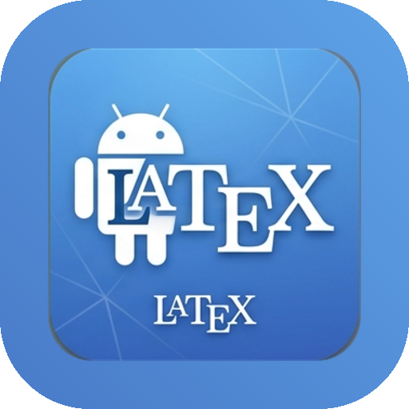

<p align="center">
  
</p>

<h1 align="center">TexDroid</h1>

<p align="center"><strong>Nativer LaTeX/XeTeX-Editor für Android — Tablet-first.</strong></p>

Schreibe LaTeX direkt auf dem Tablet und sieh live nebenan das PDF — ohne Terminal,
ohne Cloud-Zwang. TexDroid verbindet Editor, lokalen Compiler und PDF-Vorschau in
einer nativen Android-Oberfläche — mit deutscher Fehlerausgabe und einem
**optionalen** KI-Assistenten (eigener API-Key, standardmäßig aus).


_Split-View auf dem Tablet: LaTeX-Editor mit Syntax-Highlighting links, live gerendertes PDF rechts — lokal via Tectonic kompiliert (hier ein Satz mit vollständigem Induktionsbeweis)._


_Touch-Palette: häufige Bausteine per Tap einfügen (Umgebungen, Mathe-Symbole, Struktur) — der Cursor landet automatisch an der richtigen Stelle._


_Mehrdatei-Projekte: Projektordner als Sidebar (Dateibaum), Datei-Wechsel per Tap — `\input` aus Unterordnern und `.bib` inklusive._


_Optionaler KI-Assistent (BYOK): Frage stellen, Kontext wählen (Markierung oder ganzes Dokument), Modell sichtbar — gesendet wird erst nach ausdrücklicher Vorschau-Bestätigung._

## Funktionen

- **Editor** mit LaTeX-Syntaxhervorhebung (TextMate-Grammatik) und Touch-Palette
  für häufige Bausteine, Umgebungen und Mathe-Symbole; Cursor landet automatisch
  an der richtigen Stelle.
- **Lokaler Compiler** (Tectonic/XeTeX) direkt auf dem Gerät — kein Terminal,
  kein Cloud-Zwang. Optionaler **Auto-Compile** beim Tippen.
- **PDF-Vorschau** nebenan (Tablet-Split-View mit verschiebbarem Trenner) bzw.
  per Tab auf schmalen Displays.
- **Fehler auf Deutsch**: die häufigsten TeX-Meldungen werden ins Deutsche
  übersetzt; Tippen springt zur Fehlerzeile.
- **Mehrdatei-Projekte**: Projektordner-Sidebar (Dateibaum), Datei-Wechsel per Tap,
  `\input`/`\include` und Bibliografie (`bibtex`, sowie `biblatex` mit `backend=bibtex`).
- **Editor-Komfort**: Suchen & Ersetzen (inkl. Regex), Gehe zu Zeile, Kommentar
  ein/aus für Zeile oder Auswahl.
- **Assistenten & Vorlagen**: Dokument- und Tabellen-Assistent, kuratierte
  Vorlagen (Beamer, Thesis, Brief, Klausur) sowie **eigene Vorlagen** — das
  aktuelle Dokument als benannte Vorlage ablegen (offline, interner Speicher)
  und jederzeit wieder laden oder löschen.
- **Teilen & Speichern**: PDF und/oder `.tex`-Quelle teilen, PDF exportieren,
  Dateien via Storage Access Framework öffnen und speichern.
- **KI-Assistent (optional, Opt-in)**: eigener API-Key (**BYOK**) für Anthropic,
  OpenAI oder Google Gemini; Kontext wahlweise Markierung oder ganzes Dokument;
  **Rückfragen im Gespräch** (die letzten Runden werden mitgeschickt, die KI
  kennt den Zusammenhang); **„Fehler erklären"** direkt an jedem Compile-Fehler;
  Ergebnis einfügen/ersetzen oder kopieren. Verpflichtender Vorschau-Dialog vor
  jedem Aufruf. Keys bleiben **verschlüsselt lokal** (Android Keystore). Die
  Kern-App funktioniert **vollständig offline**.

## Ziel (v1.0)

Eine Person mit Android-Tablet kann: App aus F-Droid installieren → Projektordner
wählen → `.tex` schreiben → live nebenan das PDF sehen → bei Fehlern zur Zeile
springen.

## Warum

Auf Android/F-Droid gibt es bisher **keine** Open-Source-App, die Editor,
PDF-Vorschau und einen lokalen, XeTeX-fähigen Compiler nahtlos in einer Oberfläche
vereint. Vorhandenes ist entweder reine Terminal-Bedienung (Termux + TeX Live),
proprietär/cloud-abhängig (VerbTeX) oder nur ein Formel-Renderer.

## Tech-Stack

| Komponente   | Technologie |
|--------------|-------------|
| UI           | Jetpack Compose (Kotlin), adaptive Layouts via `WindowSizeClass` |
| Editor       | [`sora-editor`](https://github.com/Rosemoe/sora-editor) — Syntax-Highlighting |
| Compiler     | [Tectonic](https://tectonic-typesetting.github.io/) (Rust, MIT) via `cargo-ndk` als `.so`, JNI-Bindung Rust ↔ Kotlin |
| PDF-Anzeige  | Android `PdfRenderer` (Bordmittel) |
| Dateizugriff | Storage Access Framework (SAF), Teilen via `FileProvider` |
| KI-Assistent | optional, BYOK — Anthropic · OpenAI · Gemini über `HttpURLConnection` (keine Netzwerk-Dependency); Keys via Android Keystore verschlüsselt |

**ABI-Targets:** `arm64-v8a` (echte Geräte) + `x86_64` (Emulator), je als eigene
APK (ABI-Splits). `armeabi-v7a` (alte 32-bit-Geräte) noch offen.

## Status

🧪 **Alpha** — auf echten Geräten nutzbar (Galaxy Tab S8 Ultra, S9, S5e; Android
11 & 16). Roadmap und Milestones siehe [`PROJECT.md`](./PROJECT.md).

- [x] **M0** — Proof of Concept (Rust↔Kotlin-Brücke, erstes PDF lokal erzeugt)
- [x] **M1** — Basis-Editor + Compile-Loop
- [x] **M2** — PDF-Preview + Tablet-Split-View
- [x] **M3** — Live/Auto-Compile & UX
- [x] **Extras** — Assistenten & Vorlagen, PDF/`.tex` teilen, deutsche Fehlermeldungen
- [x] **MA — KI-Assistent** — optionaler BYOK-Assistent (Anthropic · OpenAI · Gemini), „Fehler erklären"
- [x] **M4** — Projektverwaltung (Multi-File, Bibliografie)
- [x] **ME** — Editor-Komfort (Suchen & Ersetzen, Gehe zu Zeile, Kommentar) + TeX-Branding
- [x] **MR** — Alpha-Release: signierte APK, auf 3 Geräten verifiziert
- [ ] **M5** — F-Droid-Release
- [ ] **M6** — Play-Store-Release (optional)

> Der KI-Assistent ist **standardmäßig aus** und rein optional. Nur wenn du ihn
> aktivierst und einen eigenen API-Key hinterlegst, spricht die App mit einem
> externen Dienst (F-Droid-Anti-Feature `NonFreeNetwork`). Ohne ihn bleibt
> TexDroid vollständig offline und quelloffen nutzbar.

## Installieren (Alpha)

Vorgebaute, signierte APKs gibt es unter
[**Releases**](https://github.com/thobgg/TexDroid/releases):

- **Tablet/Handy:** `…-arm64-v8a.apk` · **Emulator:** `…-x86_64.apk`
- **Auto-Updates:** dieses Repo als Quelle in [Obtainium](https://github.com/ImranR98/Obtainium) hinzufügen.
- Voraussetzung: **Android 8.0+**, „Installation aus unbekannten Quellen" erlauben.

> Der **erste Compile** lädt einmalig das TeX-Paket-Bundle übers Netz (~1–2 Min);
> ein Hinweis erscheint. Danach arbeitet TexDroid vollständig offline.

## Native Build (Tectonic)

Die native Bibliothek (`rust/` → `libtexdroid_native.so`) bettet den Tectonic-Compiler
ein. Tectonic braucht einen für Android cross-kompilierten C-Stack (ICU, HarfBuzz,
FreeType, graphite2, libpng, fontconfig) — dafür nutzen wir **vcpkg** als
`TECTONIC_DEP_BACKEND`.

**Einmalige Einrichtung:**

```bash
# Rust + Android-Targets + cargo-ndk
rustup target add x86_64-linux-android aarch64-linux-android
cargo install cargo-ndk

# NDK: via Android Studio → SDK Manager → SDK Tools → "NDK (Side by side)"

# Host-Tools (Debian/Ubuntu)
sudo apt install -y cmake ninja-build pkg-config autoconf automake \
  libtool libtool-bin bison gperf autoconf-archive

# vcpkg + C-Stack für das gewünschte Android-Triplet (Beispiel: Emulator = x64-android)
git clone https://github.com/microsoft/vcpkg ~/vcpkg && ~/vcpkg/bootstrap-vcpkg.sh
ANDROID_NDK_HOME=~/Android/Sdk/ndk/<version> ~/vcpkg/vcpkg install --triplet x64-android \
  "harfbuzz[core,freetype,graphite2,icu,png]" freetype graphite2 icu libpng fontconfig
# für echte Tablets zusätzlich: --triplet arm64-android
```

**Bauen:**

```bash
./build-native.sh                    # x86_64 (Emulator)
./build-native.sh x86_64 arm64-v8a   # beide (arm64 braucht den arm64-android-Stack)
./gradlew :app:assembleDebug         # baut je ABI eine eigene APK (ABI-Splits)
./gradlew :app:installDebug          # installiert die zum Gerät passende Variante
```

Das Skript legt `libtexdroid_native.so` **und** `libc++_shared.so` in
`app/src/main/jniLibs/<abi>/` ab (HarfBuzz/ICU sind C++ und brauchen die NDK-Laufzeit).

Über **ABI-Splits** entstehen getrennte APKs pro Architektur (jede native
Tectonic-Lib ist ~60 MB), z.B. `app-arm64-v8a-debug.apk` (~80 MB, fürs Tablet)
und `app-x86_64-debug.apk` (fürs Emulator) unter `app/build/outputs/apk/debug/`.

> **Status:** `x86_64` (Emulator) und `arm64-v8a` (echte Geräte) sind gebaut und
> getestet — der arm64-Build läuft auf Galaxy Tab S8 Ultra, S9 (Android 16) und
> Tab S5e (Android 11), inkl. lokalem Compile. `armeabi-v7a` (32-bit) weiterhin offen.

## Lizenz

[GNU General Public License v3.0](./LICENSE) (GPLv3). Kompatibel mit Tectonic (MIT).
Der Quellcode bleibt frei; Play-Store-Distribution bleibt erlaubt.

### Drittanbieter / mitgelieferte Assets

- **LaTeX-/TeX-TextMate-Grammatik** (`app/src/main/assets/textmate/latex/`):
  `LaTeX.tmLanguage.json`, `TeX.tmLanguage.json` und `language-configuration.json`
  stammen aus **[jlelong/vscode-latex-basics](https://github.com/jlelong/vscode-latex-basics)**
  und stehen unter der **MIT-Lizenz**.
  Copyright © jlelong/vscode-latex-basics contributors.
  Vollständiger Lizenztext: [`app/src/main/assets/textmate/latex/LICENSE-vscode-latex-basics.txt`](./app/src/main/assets/textmate/latex/LICENSE-vscode-latex-basics.txt).
  Minimale Anpassung (von der MIT-Lizenz gedeckt): In `TeX.tmLanguage.json` wurde
  das Muster `(?<=^\s*)` (variable-length Look-behind in den `\if…\fi`-Regeln)
  entfernt, weil die von sora-editor genutzte `joni`-Regex-Engine (Java-Oniguruba-Port)
  — anders als Oniguruma in VS Code — kein variables Look-behind unterstützt und
  sonst die gesamte Syntax-Hervorhebung ausfällt.
- **sora-editor** (Editor-View) ist als Dependency eingebunden (LGPL v2.1),
  **ohne Modifikation der Bibliothek** – LGPL-konform.
- **Editor-Farbschemata** (`app/src/main/assets/textmate/themes/`): „Quiet Light"
  (hell) und „Darcula" (dunkel) stammen aus den Beispiel-Assets von sora-editor
  bzw. den zugrundeliegenden VS-Code-Themes und werden im TextMate-JSON-Format
  geladen.

---

_Nicht verwechseln mit der gleichnamigen, inaktiven Render-Library `hansihe/TexDroid` —
TexDroid ist eine eigenständige Editor-App._
