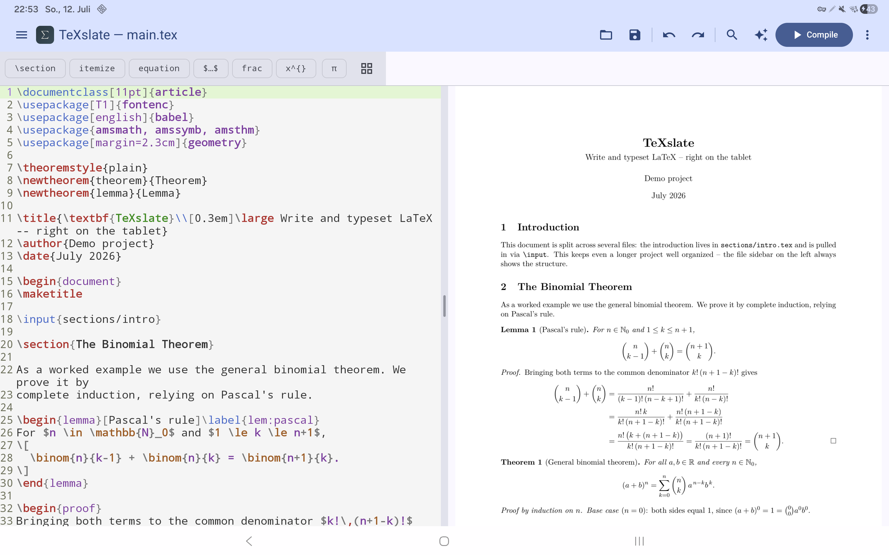
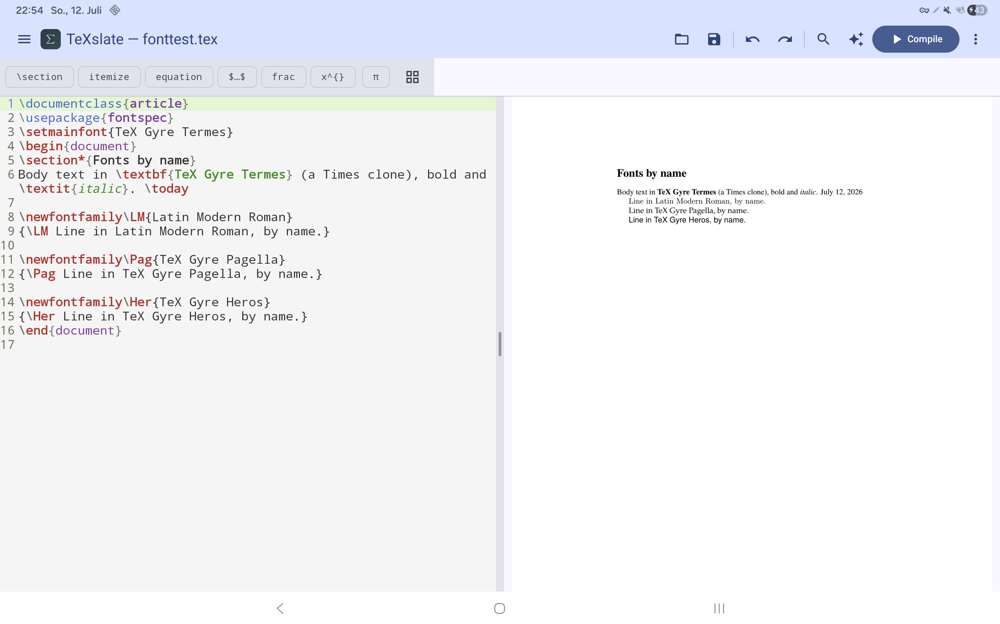
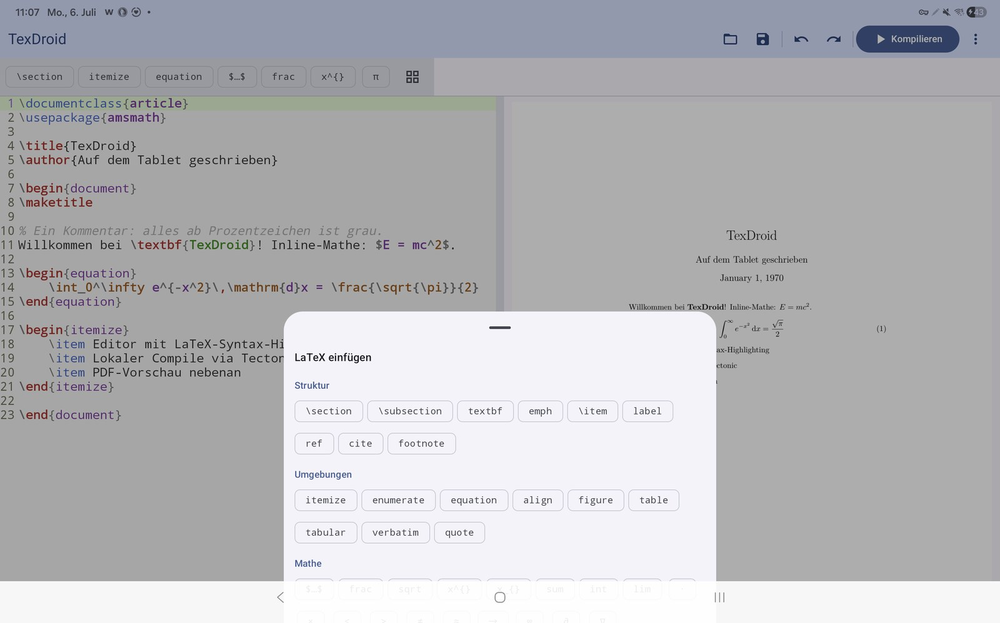
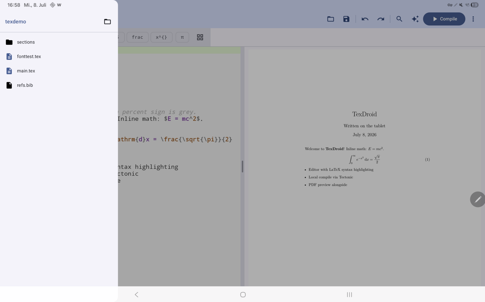
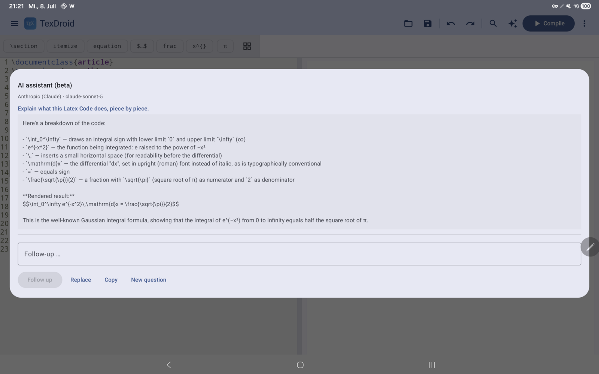

<p align="center">
  
</p>

<p align="center"><strong>Native LaTeX/XeTeX editor for Android — tablet-first.</strong></p>

Write LaTeX right on your tablet and watch the PDF render live beside it — no
terminal, no cloud, no companion PC. TeXslate combines an editor, an **on-device**
compiler and a PDF preview in one native Android UI, with localized error output
and an **optional** AI assistant (bring your own API key, off by default).

The app ships in **English (default) and German**; it follows your device
language automatically.



_Split view on a tablet: the LaTeX editor on the left, the live-rendered PDF on the right — a real multi-file project (`\input`) proving the general binomial theorem by induction, compiled locally via Tectonic._



_Fonts by name: `\setmainfont{TeX Gyre Termes}` and friends just work — bundled Latin Modern & TeX Gyre plus your Android system fonts, all resolvable by name._



_Touch palette: insert common building blocks with one tap (environments, math symbols, structure) — the cursor lands in the right place automatically._



_Multi-file projects: the project folder as a sidebar (file tree), switch files with a tap — `\input` from subfolders and `.bib` included._



_Optional AI assistant (BYOK): select a piece of LaTeX you don't understand and have it explained line by line (here the Gaussian integral). It clarifies source code — it is not a general chatbot. Nothing is sent until you confirm in the preview dialog._

## Features

- **Editor** with LaTeX syntax highlighting (TextMate grammar) and a touch palette
  for common building blocks, environments and math symbols; the cursor lands in
  the right place automatically.
- **On-device compiler** (Tectonic/XeTeX) — no terminal, no cloud. Optional
  **auto-compile** as you type.
- **PDF preview** alongside (tablet split view with a draggable divider) or as a
  tab on narrow displays.
- **Fonts by name**: `\setmainfont{…}` works offline — a curated set (Latin
  Modern Roman, TeX Gyre Termes/Pagella/Heros) is bundled and resolvable by name,
  as are your Android system fonts and any `.otf`/`.ttf` you drop into the app's
  font folder.
- **Localized errors**: the most common TeX messages are rewritten as short,
  readable sentences in the UI language; tapping jumps to the error line.
- **Multi-file projects**: project-folder sidebar (file tree), tap to switch files,
  `\input`/`\include` and bibliography (`bibtex`, and `biblatex` with `backend=bibtex`).
- **Editor comfort**: search & replace (incl. regex), go to line, **document
  outline** (jump to sections like in Kile), toggle comment for a line or a
  selection, a grabbable scroll thumb.
- **Wizards & templates**: document and table wizards, curated templates (Beamer,
  thesis, letter, exam) plus **your own templates** — save the current document as
  a named template (offline, internal storage) and reload or delete it anytime.
- **Share & save**: share the PDF and/or the `.tex` source, export the PDF, open
  and save files via the Storage Access Framework.
- **AI assistant (optional, opt-in)**: your own API key (**BYOK**) for Anthropic,
  OpenAI or Google Gemini; context is a selection or the whole document;
  **follow-up questions in a conversation** (the last rounds are included so the
  model keeps context); **“Explain error”** right on any compile error;
  insert/replace or copy the result. A mandatory preview dialog before every call.
  Keys stay **encrypted locally** (Android Keystore). The core app works
  **fully offline**, and the assistant replies in the UI language.
- **About screen** (overflow menu): version, developer, license and the bundled
  open-source components.

## Why

There is no open-source Android app that combines an editor, a PDF preview and an
**on-device, offline, XeTeX-capable** compiler in one UI. LaTeX editors for
Android do exist — what is missing is the combination of *open source + compiles
truly on the device, without a cloud or a PC*:

- **Termux + TeX Live / Tectonic**: fully capable, but pure terminal use — no
  integrated UX, a high barrier to entry.
- **VerbTeX** (the best-known direct comparison): proprietary, and it **never
  compiles on the device** — the free version sends your project to the Verbosus
  **cloud** (account + internet required), and “VerbTeX Local” needs a server you
  run on a **PC on the same network**. No real offline/on-device compile, not open
  source. This is exactly where TeXslate comes in.
- Formula-only renderers (e.g. jlatexmath): not a full engine.

## Tech stack

| Component     | Technology |
|---------------|------------|
| UI            | Jetpack Compose (Kotlin), adaptive layouts via `WindowSizeClass` |
| Editor        | [`sora-editor`](https://github.com/Rosemoe/sora-editor) — syntax highlighting |
| Compiler      | [Tectonic](https://tectonic-typesetting.github.io/) (Rust, MIT) via `cargo-ndk` as an `.so`, JNI bridge Rust ↔ Kotlin |
| PDF rendering | Android `PdfRenderer` (built-in) |
| File access   | Storage Access Framework (SAF), sharing via `FileProvider` |
| AI assistant  | optional, BYOK — Anthropic · OpenAI · Gemini over `HttpURLConnection` (no networking dependency); keys encrypted via Android Keystore |

**ABI targets:** `arm64-v8a` (real devices) + `x86_64` (emulator), each as its own
APK (ABI splits). `armeabi-v7a` (older 32-bit devices) is still open.

## Status

🧪 **Alpha** — usable on real devices (Galaxy Tab S8 Ultra, S9, S5e; Android 11 &
16). Roadmap and milestones: see [`PROJECT.md`](./PROJECT.md).

- [x] **M0** — proof of concept (Rust↔Kotlin bridge, first PDF produced locally)
- [x] **M1** — basic editor + compile loop
- [x] **M2** — PDF preview + tablet split view
- [x] **M3** — live/auto-compile & UX
- [x] **Extras** — wizards & templates, share PDF/`.tex`, localized errors, fonts by name
- [x] **MA — AI assistant** — optional BYOK assistant (Anthropic · OpenAI · Gemini), “Explain error”
- [x] **M4** — project management (multi-file, bibliography)
- [x] **ME** — editor comfort (search & replace, go to line, comment) + TeX branding
- [x] **MR** — alpha releases: signed APKs, verified on three devices; English + German UI
- [ ] **M5** — F-Droid release
- [ ] **M6** — Play Store release (optional)

> The AI assistant is **off by default** and entirely optional. Only if you enable
> it and add your own API key does the app talk to an external service (F-Droid
> anti-feature `NonFreeNetwork`). Without it, TeXslate stays fully offline and
> open-source.

## 🧪 Alpha testers wanted!

TeXslate works on the developer's devices — now it needs **yours**. If you write
LaTeX and own an Android tablet or phone, five minutes of your time help a lot:

1. Install the latest APK from the [**Releases**](https://github.com/thobgg/TeXslate/releases) page (see below).
2. Compile any document — the first compile downloads the TeX bundle once (~1–2 min).
3. Tell us how it went: [**tester feedback**](https://github.com/thobgg/TeXslate/issues/new?template=tester_feedback.yml)
   (two minutes, no bug required) or a [**bug report**](https://github.com/thobgg/TeXslate/issues/new?template=bug_report.yml).
   For open questions and ideas there are [**Discussions**](https://github.com/thobgg/TeXslate/discussions).

Especially valuable right now: **non-Samsung devices**, phones (the tab layout is
newer than the tablet split view), Android 8–10, and real-world documents (theses,
Beamer decks, `biblatex` bibliographies). _Feedback auf Deutsch ist genauso
willkommen._

## Install (alpha)

Prebuilt, signed APKs are on the
[**Releases**](https://github.com/thobgg/TeXslate/releases) page:

- **Tablet/phone:** `…-arm64-v8a.apk` · **emulator:** `…-x86_64.apk`
- **Auto-updates:** add this repo as a source in [Obtainium](https://github.com/ImranR98/Obtainium)
  — the recommended install path during the alpha.
- Requirements: **Android 8.0+**, allow “install from unknown sources”.

> The **first compile** downloads the TeX package bundle once over the network
> (~1–2 min); a hint is shown. After that TeXslate works fully offline.

## Native build (Tectonic)

The native library (`rust/` → `libtexdroid_native.so`) embeds the Tectonic
compiler. Tectonic needs an Android cross-compiled C stack (ICU, HarfBuzz,
FreeType, graphite2, libpng, fontconfig) — we use **vcpkg** as
`TECTONIC_DEP_BACKEND`.

**One-time setup:**

```bash
# Rust + Android targets + cargo-ndk
rustup target add x86_64-linux-android aarch64-linux-android
cargo install cargo-ndk

# NDK: via Android Studio → SDK Manager → SDK Tools → "NDK (Side by side)"

# Host tools (Debian/Ubuntu)
sudo apt install -y cmake ninja-build pkg-config autoconf automake \
  libtool libtool-bin bison gperf autoconf-archive

# vcpkg + C stack for the desired Android triplet (example: emulator = x64-android)
git clone https://github.com/microsoft/vcpkg ~/vcpkg && ~/vcpkg/bootstrap-vcpkg.sh
ANDROID_NDK_HOME=~/Android/Sdk/ndk/<version> ~/vcpkg/vcpkg install --triplet x64-android \
  "harfbuzz[core,freetype,graphite2,icu,png]" freetype graphite2 icu libpng fontconfig
# for real tablets also: --triplet arm64-android
```

**Build:**

```bash
./build-native.sh                    # x86_64 (emulator)
./build-native.sh x86_64 arm64-v8a   # both (arm64 needs the arm64-android stack)
./gradlew :app:assembleDebug         # builds one APK per ABI (ABI splits)
./gradlew :app:installDebug          # installs the variant matching the device
```

The script places `libtexdroid_native.so` **and** `libc++_shared.so` in
`app/src/main/jniLibs/<abi>/` (HarfBuzz/ICU are C++ and need the NDK runtime).

**ABI splits** produce separate APKs per architecture (each native Tectonic lib is
~60 MB), e.g. `app-arm64-v8a-debug.apk` (~80 MB, for the tablet) and
`app-x86_64-debug.apk` (for the emulator) under `app/build/outputs/apk/debug/`.

> **Status:** `x86_64` (emulator) and `arm64-v8a` (real devices) are built and
> tested — the arm64 build runs on Galaxy Tab S8 Ultra, S9 (Android 16) and Tab
> S5e (Android 11), including local compile. `armeabi-v7a` (32-bit) is still open.

## License

[GNU General Public License v3.0](./LICENSE) (GPLv3). Compatible with Tectonic
(MIT). The source stays free; Play Store distribution remains permitted.

### Third-party / bundled assets

- **Bundled fonts** (`app/src/main/assets/fonts/`): **Latin Modern Roman** and
  **TeX Gyre Termes/Pagella/Heros** (regular/bold/italic/bold-italic) are shipped
  so `\setmainfont{…}` resolves them by name. They are licensed under the
  **GUST Font License (LPPL-based)**; the license text is included at
  [`app/src/main/assets/fonts/GUST-FONT-LICENSE.txt`](./app/src/main/assets/fonts/GUST-FONT-LICENSE.txt).
- **LaTeX/TeX TextMate grammar** (`app/src/main/assets/textmate/latex/`):
  `LaTeX.tmLanguage.json`, `TeX.tmLanguage.json` and `language-configuration.json`
  come from **[jlelong/vscode-latex-basics](https://github.com/jlelong/vscode-latex-basics)**
  under the **MIT license**. Copyright © jlelong/vscode-latex-basics contributors.
  Full text: [`app/src/main/assets/textmate/latex/LICENSE-vscode-latex-basics.txt`](./app/src/main/assets/textmate/latex/LICENSE-vscode-latex-basics.txt).
  Minimal change (permitted by MIT): in `TeX.tmLanguage.json` the pattern
  `(?<=^\s*)` (variable-length look-behind in the `\if…\fi` rules) was removed
  because the `joni` regex engine used by sora-editor (a Java Oniguruma port) —
  unlike Oniguruma in VS Code — does not support variable-length look-behind and
  would otherwise break the entire syntax highlighting.
- **sora-editor** (editor view) is a dependency (LGPL v2.1), **without modifying
  the library** — LGPL-compliant.
- **Editor color schemes** (`app/src/main/assets/textmate/themes/`): “Quiet Light”
  (light) and “Darcula” (dark) come from the sora-editor sample assets / the
  underlying VS Code themes and are loaded in TextMate JSON format.

