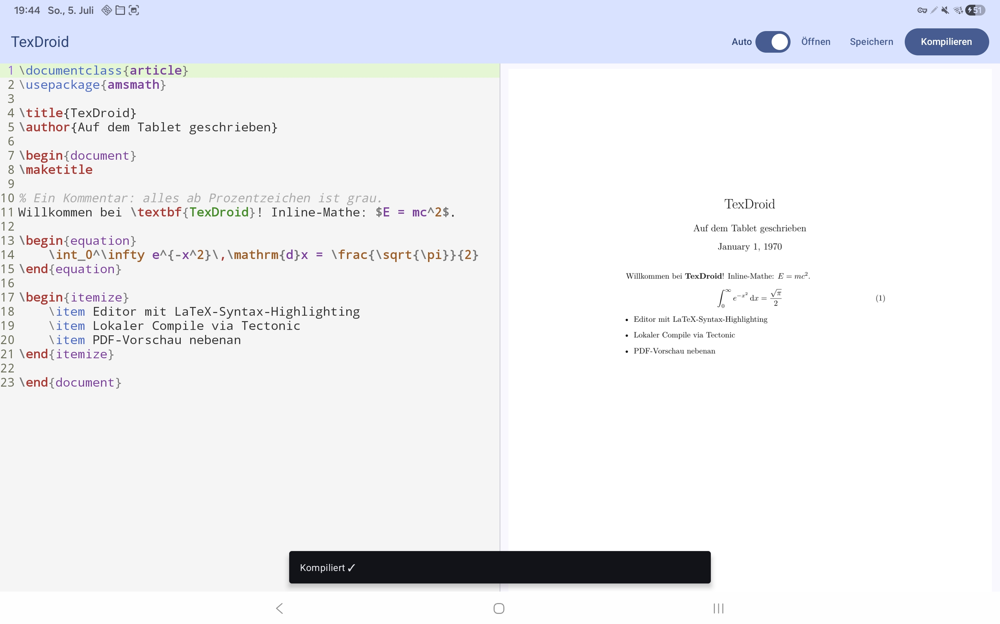

# TexDroid

**Nativer LaTeX/XeTeX-Editor für Android — Tablet-first.**

Schreibe LaTeX direkt auf dem Tablet und sieh live nebenan das PDF — ohne Terminal,
ohne Cloud-Zwang. TexDroid verbindet Editor, lokalen Compiler und PDF-Vorschau in
einer nativen Android-Oberfläche.



_Split-View auf dem Tablet: LaTeX-Editor mit Syntax-Highlighting links, Live-PDF-Vorschau rechts — lokal via Tectonic kompiliert._

## Ziel (v1.0)

Eine Person mit Android-Tablet kann: App aus F-Droid installieren → Projektordner
wählen → `.tex` schreiben → live nebenan das PDF sehen → bei Fehlern zur Zeile
springen.

## Warum

Auf Android/F-Droid gibt es bisher **keine** Open-Source-App, die Editor,
PDF-Vorschau und einen lokalen, XeTeX-fähigen Compiler nahtlos in einer Oberfläche
vereint. Vorhandenes ist entweder reine Terminal-Bedienung (Termux + TeX Live),
proprietär/cloud-abhängig (VerbTeX) oder nur ein Formel-Renderer.

## Tech-Stack

| Komponente   | Technologie |
|--------------|-------------|
| UI           | Jetpack Compose (Kotlin), adaptive Layouts via `WindowSizeClass` |
| Editor       | [`sora-editor`](https://github.com/Rosemoe/sora-editor) — Syntax-Highlighting |
| Compiler     | [Tectonic](https://tectonic-typesetting.github.io/) (Rust, MIT) via `cargo-ndk` als `.so`, JNI-Bindung Rust ↔ Kotlin |
| PDF-Anzeige  | Android `PdfRenderer` (Bordmittel) |
| Dateizugriff | Storage Access Framework (SAF) |

**ABI-Targets:** `arm64-v8a`, `armeabi-v7a`.

## Status

🚧 In früher Entwicklung. Roadmap und Milestones siehe [`PROJECT.md`](./PROJECT.md).

- [x] **M0** — Proof of Concept (Rust↔Kotlin-Brücke, erstes PDF lokal erzeugt)
- [x] **M1** — Basis-Editor + Compile-Loop
- [x] **M2** — PDF-Preview + Tablet-Split-View
- [x] **M3** — Live/Auto-Compile & UX
- [ ] **M4** — Projektverwaltung (Multi-File)
- [ ] **M5** — F-Droid-Release

## Native Build (Tectonic)

Die native Bibliothek (`rust/` → `libtexdroid_native.so`) bettet den Tectonic-Compiler
ein. Tectonic braucht einen für Android cross-kompilierten C-Stack (ICU, HarfBuzz,
FreeType, graphite2, libpng, fontconfig) — dafür nutzen wir **vcpkg** als
`TECTONIC_DEP_BACKEND`.

**Einmalige Einrichtung:**

```bash
# Rust + Android-Targets + cargo-ndk
rustup target add x86_64-linux-android aarch64-linux-android
cargo install cargo-ndk

# NDK: via Android Studio → SDK Manager → SDK Tools → "NDK (Side by side)"

# Host-Tools (Debian/Ubuntu)
sudo apt install -y cmake ninja-build pkg-config autoconf automake \
  libtool libtool-bin bison gperf autoconf-archive

# vcpkg + C-Stack für das gewünschte Android-Triplet (Beispiel: Emulator = x64-android)
git clone https://github.com/microsoft/vcpkg ~/vcpkg && ~/vcpkg/bootstrap-vcpkg.sh
ANDROID_NDK_HOME=~/Android/Sdk/ndk/<version> ~/vcpkg/vcpkg install --triplet x64-android \
  "harfbuzz[core,freetype,graphite2,icu,png]" freetype graphite2 icu libpng fontconfig
# für echte Tablets zusätzlich: --triplet arm64-android
```

**Bauen:**

```bash
./build-native.sh                    # x86_64 (Emulator)
./build-native.sh x86_64 arm64-v8a   # beide (arm64 braucht den arm64-android-Stack)
./gradlew :app:assembleDebug         # baut je ABI eine eigene APK (ABI-Splits)
./gradlew :app:installDebug          # installiert die zum Gerät passende Variante
```

Das Skript legt `libtexdroid_native.so` **und** `libc++_shared.so` in
`app/src/main/jniLibs/<abi>/` ab (HarfBuzz/ICU sind C++ und brauchen die NDK-Laufzeit).

Über **ABI-Splits** entstehen getrennte APKs pro Architektur (jede native
Tectonic-Lib ist ~60 MB), z.B. `app-arm64-v8a-debug.apk` (~80 MB, fürs Tablet)
und `app-x86_64-debug.apk` (fürs Emulator) unter `app/build/outputs/apk/debug/`.

> **Status:** `x86_64` (Emulator) und `arm64-v8a` (echte Tablets) sind gebaut.
> Der x86_64-Build ist auf dem Emulator getestet; der arm64-Build ist gebaut und
> verifiziert (Symbol + `libc++_shared.so` in der APK), aber noch nicht auf einem
> echten Gerät gelaufen. `armeabi-v7a` weiterhin offen.

## Lizenz

[GNU General Public License v3.0](./LICENSE) (GPLv3). Kompatibel mit Tectonic (MIT).
Der Quellcode bleibt frei; Play-Store-Distribution bleibt erlaubt.

### Drittanbieter / mitgelieferte Assets

- **LaTeX-/TeX-TextMate-Grammatik** (`app/src/main/assets/textmate/latex/`):
  `LaTeX.tmLanguage.json`, `TeX.tmLanguage.json` und `language-configuration.json`
  stammen aus **[jlelong/vscode-latex-basics](https://github.com/jlelong/vscode-latex-basics)**
  und stehen unter der **MIT-Lizenz**.
  Copyright © jlelong/vscode-latex-basics contributors.
  Vollständiger Lizenztext: [`app/src/main/assets/textmate/latex/LICENSE-vscode-latex-basics.txt`](./app/src/main/assets/textmate/latex/LICENSE-vscode-latex-basics.txt).
  Minimale Anpassung (von der MIT-Lizenz gedeckt): In `TeX.tmLanguage.json` wurde
  das Muster `(?<=^\s*)` (variable-length Look-behind in den `\if…\fi`-Regeln)
  entfernt, weil die von sora-editor genutzte `joni`-Regex-Engine (Java-Oniguruba-Port)
  — anders als Oniguruma in VS Code — kein variables Look-behind unterstützt und
  sonst die gesamte Syntax-Hervorhebung ausfällt.
- **sora-editor** (Editor-View) ist als Dependency eingebunden (LGPL v2.1),
  **ohne Modifikation der Bibliothek** – LGPL-konform.
- **Editor-Farbschemata** (`app/src/main/assets/textmate/themes/`): „Quiet Light"
  (hell) und „Darcula" (dunkel) stammen aus den Beispiel-Assets von sora-editor
  bzw. den zugrundeliegenden VS-Code-Themes und werden im TextMate-JSON-Format
  geladen.

---

_Nicht verwechseln mit der gleichnamigen, inaktiven Render-Library `hansihe/TexDroid` —
TexDroid ist eine eigenständige Editor-App._
